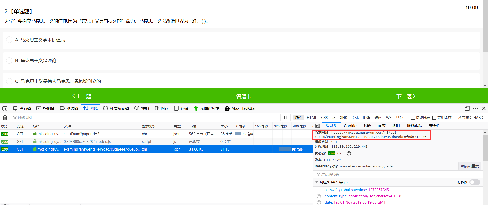
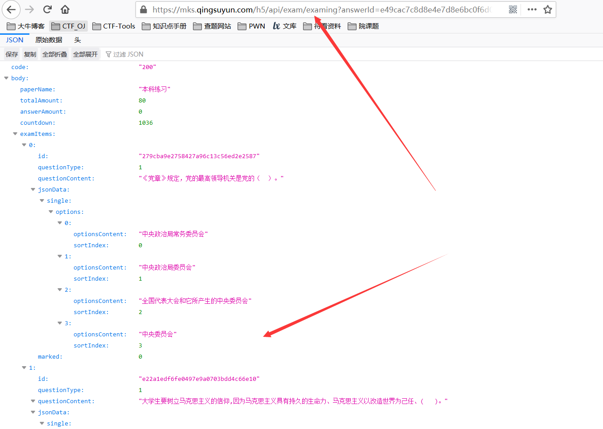
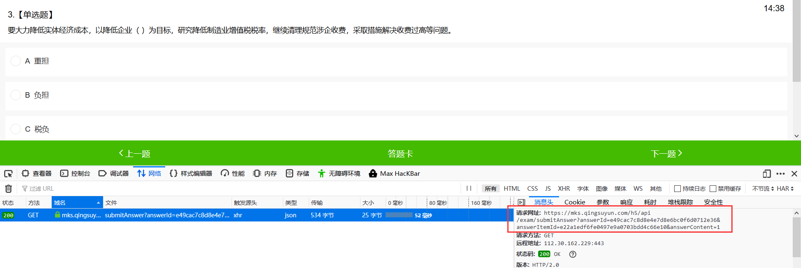
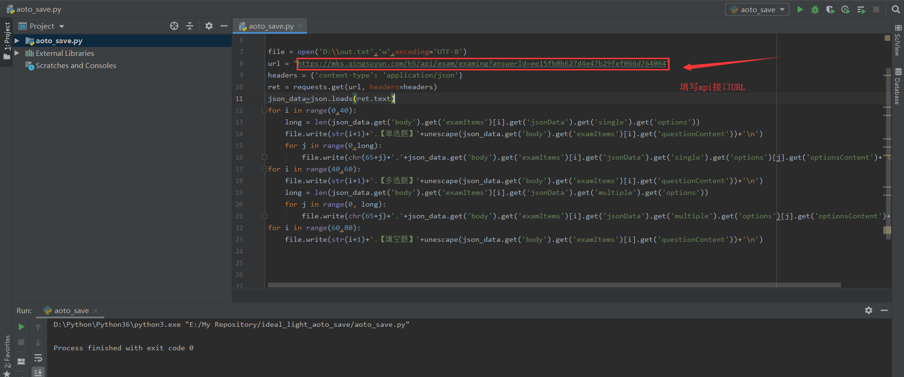
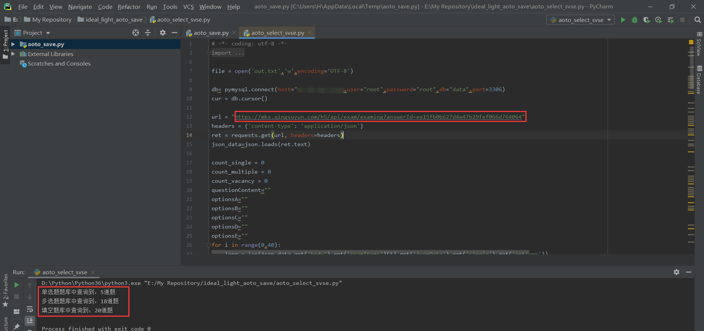

# ideal_light_aoto_save

#### 浙江省理想之光电脑端答题URL

- 本科练习：https://mks.qingsuyun.com/h5/m/login?factoryCode=100015&paperId=3
- 本科正式：https://mks.qingsuyun.com/h5/m/login?factoryCode=100015&paperId=2

#### 分析页面

采用的是轻速云的接口答题，开始答题后前段通过异步请求返回一个json类型的接口本地存储题目

访问接口，发现返回的是题目的json格式：

每次答题的时候，是通过GET请求带上用户名、题号以及选项请求后端，判断是在后端，无法预测：

但是人多力量大对吧，我们可以保存下来题目，然后分给其他人一起答题对吧，嘿嘿，于是就有了第一个脚本`aoto_save.py`

进一步的，思考是不是可以通过题库对撞来自动生成答案呢，但是理想是美好的，通过不断的爬取题目，发现单选题后台题库至少有1000道。。。裂开了，算是一个半成品吧

希望有大佬能完成AI答题，这样以后理论答题就不怕冷QAQ 

### 附一张生成的答案

